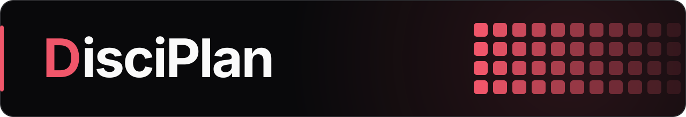
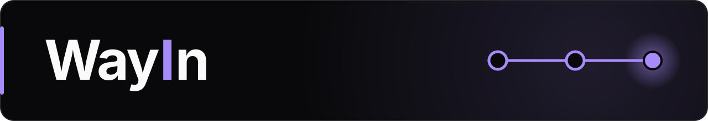
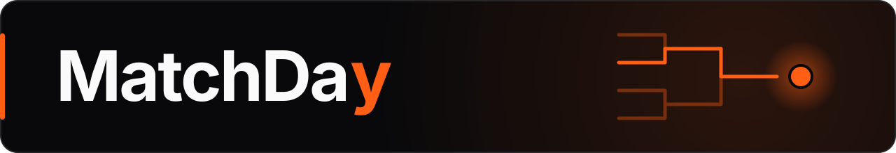
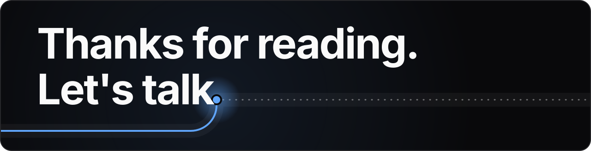

  <picture>
    <source media="(prefers-color-scheme: dark)" srcset="assets/banner.svg">
    <source media="(prefers-color-scheme: light)" srcset="assets/banner-light.svg">
    
  </picture>

I'm Walid, 22 years old, in my fifth semester of Technische Informatik at TH Köln. I came to Germany from Morocco as an international student, and I decided to just start instead of overthinking how. Today I'm a working student in technical support at voize, and I'm building things I'm proud of.

  <a href="https://waligl0ry.github.io/">
    <picture>
      <source media="(prefers-color-scheme: dark)" srcset="assets/button-portfolio.svg">
      <source media="(prefers-color-scheme: light)" srcset="assets/button-portfolio-light.svg">
      
    </picture>
  </a>

Technische Informatik an der TH Köln. <a href="https://waligl0ry.github.io/" hreflang="de">Diese Seite gibt es auch auf Deutsch.</a>

## What I build

  <a href="https://github.com/WaliGl0RY/disciplan">
    <picture>
      <source media="(prefers-color-scheme: dark)" srcset="assets/project-disciplan.svg">
      <source media="(prefers-color-scheme: light)" srcset="assets/project-disciplan-light.svg">
      
    </picture>
  </a>

A study system for eight exams: a daily plan, study documents and trainers.

`Python` `HTML/CSS/JavaScript` 07–09/2026 · [disciplan →](https://github.com/WaliGl0RY/disciplan)

  <a href="https://github.com/WaliGl0RY/job-pipeline">
    <picture>
      <source media="(prefers-color-scheme: dark)" srcset="assets/project-wayin.svg">
      <source media="(prefers-color-scheme: light)" srcset="assets/project-wayin-light.svg">
      
    </picture>
  </a>

A job search run by Claude routines: it finds postings, scores them against my CV and tracks replies. I applied myself every time. That's how I found my working student job at voize.

`Python` `SQLite` `MCP` 07–10/2026 · [job-pipeline →](https://github.com/WaliGl0RY/job-pipeline)

  <a href="https://github.com/WaliGl0RY/tournament-app">
    <picture>
      <source media="(prefers-color-scheme: dark)" srcset="assets/project-matchday.svg">
      <source media="(prefers-color-scheme: light)" srcset="assets/project-matchday-light.svg">
      
    </picture>
  </a>

A tournament app for my friends. No score counts until the opponent confirms it.

`Python` `Flask` `SQLite` `HTML/CSS/JavaScript` 06/2026 · [tournament-app →](https://github.com/WaliGl0RY/tournament-app)

## What I used

**In my projects**

`Python` `Flask` <code>SQL&nbsp;and&nbsp;SQLite</code> `HTML/CSS/JavaScript` <code>MCP&nbsp;and&nbsp;scheduled&nbsp;tasks</code> <code>Git&nbsp;and&nbsp;GitHub</code> `Railway` <code>Claude&nbsp;as&nbsp;coding&nbsp;assistant</code>

**From my studies**

- **Programming languages:** Java · C and C++
- **Systems:** Unix interface · Linux · Docker lab in BVS2
- **Networking and services:** REST, SOAP, RPC, RMI and sockets · Cisco Networking Academy courses 1–3
- **Methods and courses:** Scrum from the SWP project · Microsoft Entra ID module

## Languages

I work in German, French, English, Arabic and Moroccan Darija.

## Interests

I'm interested in networking and IT security, and I'm fascinated by the development of AI. I try to stay up to date with the newest technologies. I believe that knowing how to use AI and build your own setup is a skill everyone will need in the future.

## Contact

  <picture>
    <source media="(prefers-color-scheme: dark)" srcset="assets/closing.svg">
    <source media="(prefers-color-scheme: light)" srcset="assets/closing-light.svg">
    
  </picture>

  <a href="https://waligl0ry.github.io/">
    <picture>
      <source media="(prefers-color-scheme: dark)" srcset="assets/button-portfolio.svg">
      <source media="(prefers-color-scheme: light)" srcset="assets/button-portfolio-light.svg">
      
    </picture>
  </a>

